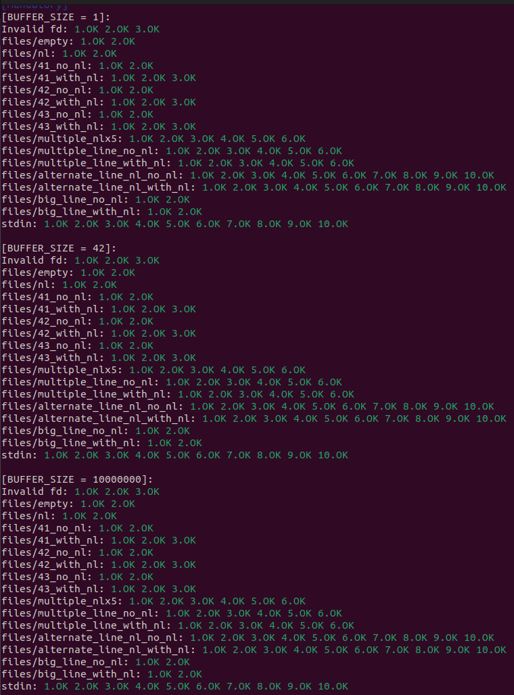
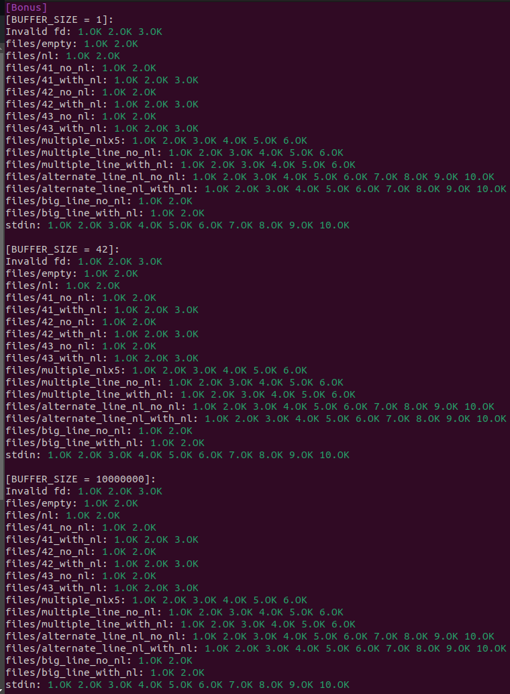
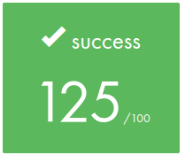
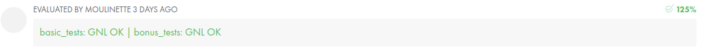
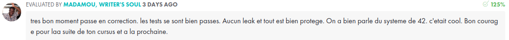

   
<p align="center">
	Ce projet t'a aidé ? Mets-lui une 🌟!  
	
# Get_Next_Line

Ce projet va non seulement nous permettre d'ajouter une fonction très pratique à notre collection, mais également d'aborder un nouvel élément surprenant dans la programmation en C : les variables statiques.
Ce projet a pour but de nous faire développer une fonction qui renvoie une ligne lue depuis un descripteur de fichier.
Tu peux trouver le sujet [ici](fr.subject.pdf).

<br>

## Télécharge et utilise la fonction ⬇️

Clone le projet.

```
git clone https://github.com/ugozchi/Get_Next_Line
cd Get_Next_Line
```

<br>

## Tests  📋

Dans ce projet, ni besoin de notre libft, ni besoin de Makefile. Nous avons malgrè tout utilisé quelques fonction de la libft que nous avons replacer dans le fichier get_next_line_utils.c.


<br>

Une fois cela vérifier, nous pouvons tester notre projet à l'aide de : [/francinette](https://github.com/xicodomingues/francinette)

<br>

Voici les résultats :

### Première partie

<br>

| |
| --- |
|  |

<br>


### Partie Bonus

<br>

| |
| --- |
|  |

<br>

| |
| --- |
|  |

<br>

## Note Final et Commentaires 📔

<br>

| |
| --- |
|  |


| | |
| --- | --- |
| Moulinette |  |
| Correcteur 1 |  |
| Correcteur 2 |  |
| Correcteur 3 |  |
